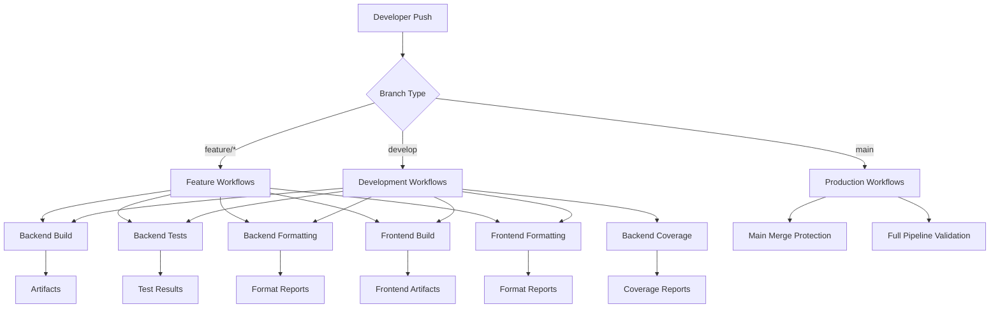

# 🚀 Pipeline de CI/CD - PharmaGo

## 📋 Tabla de Contenidos

- [Descripción General](#descripción-general)
- [Arquitectura del Pipeline](#arquitectura-del-pipeline)
- [Workflows de Backend](#workflows-de-backend)
- [Workflows de Frontend](#workflows-de-frontend)
- [Protección de Ramas](#protección-de-ramas)
- [Flujo de Trabajo GitFlow](#flujo-de-trabajo-gitflow)
- [Configuración y Optimización](#configuración-y-optimización)
- [Resolución de Problemas](#resolución-de-problemas)

---

## 🎯 Descripción General

El proyecto PharmaGo implementa un pipeline completo de **CI/CD (Continuous Integration/Continuous Deployment)** utilizando **GitHub Actions**. El pipeline está diseñado para garantizar la calidad del código, ejecutar pruebas automatizadas, verificar cobertura de código y mantener estándares de formateo tanto para el backend (.NET 6) como para el frontend (Angular 14).

### 🏗️ Componentes del Sistema

- **Backend**: .NET 6 API REST
- **Frontend**: Angular 14 SPA
- **Base de Datos**: SQL Server
- **Infraestructura**: Docker, Docker Compose
- **CI/CD**: GitHub Actions

---

## 🔄 Arquitectura del Pipeline



---

## 🖥️ Workflows de Backend

### 1. **Backend Build** (`backend-build.yml`)

**Propósito**: Compilación y validación del backend .NET

**Triggers**:
- Push a `main`, `develop`, `feature/*`
- Pull Request a `main`, `develop`
- Cambios en `Obligatorio/Material/Codigo/Backend/**`
- Ejecución manual (`workflow_dispatch`)

**Pasos del Proceso**:

1. **🔄 Checkout del Código**
   ```yaml
   uses: actions/checkout@v4
   ```

2. **⚙️ Configuración .NET 6**
   ```yaml
   uses: actions/setup-dotnet@v4
   with:
     dotnet-version: '6.0.x'
   ```

3. **📦 Cache de Paquetes NuGet**
   - Optimiza tiempo de build
   - Reduce descargas repetitivas
   - Key basado en `*.csproj` files

4. **🔄 Restauración de Dependencias**
   ```bash
   dotnet restore
   ```

5. **🏗️ Build en Configuración Release**
   ```bash
   dotnet build --configuration Release --no-restore
   ```

6. **📤 Upload de Artefactos**
   - Binarios compilados
   - Retención: 1 día

### 2. **Backend Unit Tests** (`backend-unit-test.yml`)

**Propósito**: Ejecución de pruebas unitarias

**Características**:
- Configuración Release para testing
- Logger TRX para integración con herramientas
- Console logger con verbosity detallada
- Upload de resultados como artefactos

**Proceso**:
```bash
dotnet test --configuration Release --no-build \
  --logger "trx;LogFileName=unit-test-results.trx" \
  --logger "console;verbosity=detailed" \
  --results-directory ./TestResults
```

### 3. **Backend Code Coverage** (`backend-code-coverage.yml`)

**Propósito**: Análisis de cobertura de código con umbral mínimo del 90%

**Herramientas**:
- **XPlat Code Coverage**: Recolección de datos
- **ReportGenerator**: Generación de reportes HTML y badges

**Proceso Detallado**:

1. **📊 Ejecución de Tests con Coverage**
   ```bash
   dotnet test --collect:"XPlat Code Coverage" \
     --results-directory ./TestResults
   ```

2. **📈 Generación de Reportes**
   ```bash
   reportgenerator \
     -reports:"./TestResults/**/coverage.cobertura.xml" \
     -targetdir:"./TestResults/CoverageReport" \
     -reporttypes:"Html;Cobertura;TextSummary;Badges"
   ```

3. **🎯 Validación de Umbral**
   - Extrae porcentaje de `Summary.txt`
   - Compara con `MINIMUM_COVERAGE: 90`
   - Falla si no cumple el umbral

**Outputs**:
- Reporte HTML interactivo
- Badges de coverage
- Archivo Cobertura XML
- Retención: 30 días

### 4. **Backend Code Formatting** (`backend-formatting.yml`)

**Propósito**: Verificación y aplicación de estándares de formato

**Herramientas**:
- **dotnet format**: Herramienta oficial de Microsoft
- **.editorconfig**: Configuración de estilos

**Proceso de Verificación**:

1. **🔧 Instalación de Herramientas**
   ```bash
   dotnet tool install -g dotnet-format
   ```

2. **📋 Verificación de .editorconfig**
   - Valida existencia del archivo
   - Muestra preview de configuración

3. **🎨 Aplicación y Verificación**
   ```bash
   # Primera pasada: Aplica formato
   dotnet format --verbosity minimal
   
   # Segunda pasada: Verifica que no hay más cambios
   dotnet format --verify-no-changes --verbosity minimal
   ```

4. **🔍 Verificaciones Adicionales**
   - Detección de tabs vs espacios
   - Trailing whitespace
   - Consistencia de line endings

---

## 🌐 Workflows de Frontend

### 1. **Frontend Build** (`frontend-build.yml`)

**Propósito**: Build y testing de la aplicación Angular

**Stack Tecnológico**:
- **Node.js 18.x LTS**
- **Angular 14**
- **npm ci** para instalación determinística

**Proceso**:

1. **🔄 Setup del Entorno**
   ```yaml
   uses: actions/setup-node@v4
   with:
     node-version: '18.x'
     cache: 'npm'
   ```

2. **📦 Instalación de Dependencias**
   ```bash
   npm ci  # Instalación limpia desde package-lock.json
   ```

3. **🏗️ Build de Producción**
   ```bash
   npm run build --prod
   ```

4. **🧪 Ejecución de Tests Unitarios**
   ```bash
   npm run test -- --watch=false --browsers=ChromeHeadless --code-coverage
   ```

**Artefactos Generados**:
- **Build artifacts** (`dist/`): 1 día retención
- **Coverage reports** (`coverage/`): 5 días retención

### 2. **Frontend Code Formatting** (`frontend-formatting.yml`)

**Propósito**: Verificación de estándares de código en Angular

**Herramientas de Formateo**:
- **Prettier**: Formateo de código
- **ESLint**: Linting específico para Angular
- **@angular-eslint**: Reglas específicas de Angular

**Configuración Automática**:

1. **📋 Instalación de Herramientas**
   ```bash
   npm install --save-dev prettier eslint @angular-eslint/builder \
     @angular-eslint/eslint-plugin @angular-eslint/eslint-plugin-template \
     @typescript-eslint/eslint-plugin eslint-config-prettier
   ```

2. **⚙️ Configuración por Defecto de Prettier**
   ```json
   {
     "semi": true,
     "trailingComma": "es5",
     "singleQuote": true,
     "printWidth": 80,
     "tabWidth": 2,
     "useTabs": false
   }
   ```

3. **🎨 Verificación de Formato**
   ```bash
   npx prettier --check "src/**/*.{ts,js,html,css,scss,json}"
   ```

4. **🔍 Linting con ESLint**
   ```bash
   npx eslint "src/**/*.{ts,js}" --max-warnings 0
   ```

**Verificaciones Adicionales**:
- Detección de tabs vs espacios
- Trailing whitespace
- Line endings (CRLF vs LF)

---

## 🛡️ Protección de Ramas

### **Main Merge Protection** (`main-merge.yml`)

**Propósito**: Garantizar que solo la rama `develop` pueda hacer merge a `main`

**Validaciones**:

1. **🔍 Verificación de Rama Origen**
   ```bash
   if [[ "${{ github.head_ref }}" != "develop" ]]; then
     echo "❌ MERGE REJECTED: PRs to main are only allowed from develop branch"
     exit 1
   fi
   ```

2. **📋 Resumen de Requisitos**
   - Source branch: `develop`
   - Backend Build: ✅
   - Backend Unit Tests: ✅
   - Backend Code Coverage ≥90%: ✅
   - PR Review Approval: ✅

**Status Checks Requeridos**:
- Todos los workflows de backend deben pasar
- Todos los workflows de frontend deben pasar
- Al menos 1 review approval

---

## 🌊 Flujo de Trabajo GitFlow

### **Estrategia de Branching**

```
main
├── develop
│   ├── feature/frontend-actions
│   ├── feature/backend-authentication
│   └── feature/database-optimization
└── hotfix/critical-bug-fix
```

### **Flujo de Desarrollo**

1. **Feature Development**
   ```bash
   # Crear feature branch desde develop
   git checkout develop
   git checkout -b feature/nueva-funcionalidad
   
   # Desarrollo y commits
   git add .
   git commit -m "feat: nueva funcionalidad"
   git push origin feature/nueva-funcionalidad
   ```

2. **Pull Request Process**
   - **feature/* → develop**: Todos los workflows se ejecutan
   - **develop → main**: Protección estricta + todos los checks

3. **Branch Protection Rules**
   - `main`: Solo acepta PRs desde `develop`
   - `develop`: Acepta PRs desde `feature/*` y `hotfix/*`
   - Status checks requeridos en ambas ramas

### **Triggers por Tipo de Rama**

| Workflow | feature/* | develop | main | PR to main | PR to develop |
|----------|-----------|---------|------|------------|---------------|
| Backend Build | ✅ | ✅ | ✅ | ✅ | ✅ |
| Backend Tests | ✅ | ✅ | ✅ | ✅ | ✅ |
| Backend Format | ✅ | ✅ | ✅ | ✅ | ✅ |
| Backend Coverage | ❌ | ✅ | ✅ | ✅ | ✅ |
| Frontend Build | ✅ | ✅ | ✅ | ✅ | ✅ |
| Frontend Format | ✅ | ✅ | ✅ | ✅ | ✅ |
| Main Protection | ❌ | ❌ | ❌ | ✅ | ❌ |

---

## ⚙️ Configuración y Optimización

### **Estrategias de Cache**

#### Backend (.NET)
```yaml
- name: Cache NuGet packages
  uses: actions/cache@v4
  with:
    path: ~/.nuget/packages
    key: ${{ runner.os }}-nuget-${{ hashFiles('**/*.csproj') }}
    restore-keys: |
      ${{ runner.os }}-nuget-
```

#### Frontend (Node.js)
```yaml
- name: Cache node modules
  uses: actions/cache@v4
  with:
    path: ${{ env.WORKING_DIRECTORY }}/node_modules
    key: ${{ runner.os }}-node-${{ hashFiles('**/package-lock.json') }}
```

### **Variables de Entorno**

| Variable | Valor | Propósito |
|----------|-------|-----------|
| `WORKING_DIRECTORY` | Backend: `Obligatorio/Material/Codigo/Backend` | Directorio base |
| | Frontend: `Obligatorio/Material/Codigo/Frontend` | |
| `MINIMUM_COVERAGE` | `90` | Umbral mínimo de cobertura |

### **Configuración de Runners**

- **OS**: `ubuntu-latest` (más rápido y económico)
- **Paralelización**: Jobs independientes corren en paralelo
- **Timeouts**: Por defecto 360 minutos

### **Gestión de Artefactos**

| Tipo | Retención | Propósito |
|------|-----------|-----------|
| Build artifacts | 1 día | Verificación inmediata |
| Test results | 7 días | Debugging |
| Coverage reports | 30 días | Análisis histórico |
| Format reports | 5 días | Corrección de errores |

---

## 🔧 Resolución de Problemas

### **Errores Comunes y Soluciones**

#### **1. Build Failures**

**Error**: `The type or namespace name could not be found`
```bash
# Solución: Limpiar y restaurar
dotnet clean
dotnet restore
dotnet build
```

**Error**: `npm ERR! package-lock.json not found`
```bash
# Solución: Regenerar package-lock
rm package-lock.json
npm install
```

#### **2. Test Failures**

**Error**: Tests pasan localmente pero fallan en CI
```bash
# Verificar configuración de tests en CI
dotnet test --logger console --verbosity detailed
```

**Error**: `ChromeHeadless not found` en tests de Angular
```yaml
# Asegurar instalación de Chrome en runner
- name: Install Chrome
  run: |
    wget -q -O - https://dl.google.com/linux/linux_signing_key.pub | sudo apt-key add -
    sudo apt-get update
    sudo apt-get install google-chrome-stable
```

#### **3. Coverage Issues**

**Error**: Cobertura por debajo del umbral
1. Revisar reportes de coverage en artifacts
2. Identificar código sin testear
3. Agregar tests unitarios
4. Verificar que tests ejecuten el código

#### **4. Formatting Issues**

**Backend**: Problemas con `dotnet format`
```bash
# Verificar .editorconfig
cat .editorconfig

# Aplicar formato manualmente
dotnet format --verbosity diagnostic
```

**Frontend**: Problemas con Prettier/ESLint
```bash
# Aplicar formato automáticamente
npx prettier --write "src/**/*.{ts,js,html,css,scss,json}"
npx eslint "src/**/*.{ts,js}" --fix
```

### **Debugging de Workflows**

1. **Activar Debug Logging**
   ```yaml
   env:
     ACTIONS_STEP_DEBUG: true
     ACTIONS_RUNNER_DEBUG: true
   ```

2. **Usar SSH para Debug Remoto**
   ```yaml
   - name: Setup tmate session
     uses: mxschmitt/action-tmate@v3
   ```

3. **Verificar Variables de Entorno**
   ```yaml
   - name: Debug Environment
     run: |
       echo "Working Directory: ${{ env.WORKING_DIRECTORY }}"
       echo "GitHub Event: ${{ github.event_name }}"
       echo "Branch: ${{ github.ref }}"
   ```

### **Monitoreo y Métricas**

1. **GitHub Actions Usage**
   - Revisar límites de minutos mensuales
   - Optimizar workflows para reducir tiempo

2. **Success Rate Monitoring**
   - Trackear ratio de builds exitosos
   - Identificar patterns de fallos

3. **Performance Metrics**
   - Tiempo promedio de build
   - Tiempo de ejecución de tests
   - Eficiencia del cache

---

## 📈 Mejoras Futuras

### **Posibles Optimizaciones**

1. **Matrix Strategy para Multiple Environments**
   ```yaml
   strategy:
     matrix:
       dotnet-version: ['6.0.x', '7.0.x']
       os: [ubuntu-latest, windows-latest]
   ```

2. **Deployment Automático**
   - Stage environment deployment en develop
   - Production deployment en main merge

3. **Integration Testing**
   - Docker Compose para tests de integración
   - Database seeding automático

4. **Security Scanning**
   - Dependabot para vulnerabilidades
   - SAST (Static Application Security Testing)

5. **Performance Testing**
   - Load testing automático
   - Performance regression detection

---

## 📚 Referencias

- [GitHub Actions Documentation](https://docs.github.com/en/actions)
- [.NET CLI Documentation](https://docs.microsoft.com/en-us/dotnet/core/tools/)
- [Angular CLI Documentation](https://angular.io/cli)
- [GitFlow Workflow](https://www.atlassian.com/git/tutorials/comparing-workflows/gitflow-workflow)

---

**Última actualización**: 2 de Octubre, 2025  
**Versión del Pipeline**: 1.0.0  
**Mantenido por**: Equipo ISA2 (292814-286845-288818)